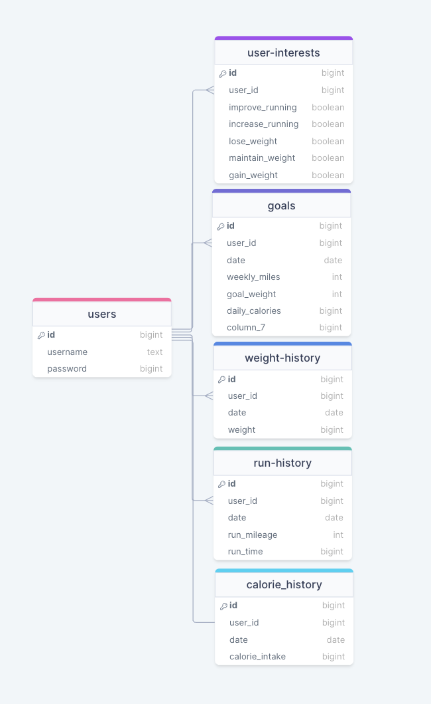

# Fit Fusion

Table of Contents

- [Fit Fusion](#fit-fusion)
  - [Table of Contents](#table-of-contents)
  - [Overview](#overview)
  - [Key Sections](#key-sections)
    - [1. Login and Sign Up](#1-login-and-sign-up)
    - [2. Dashboard](#2-dashboard)
    - [3. My Goals](#3-my-goals)
    - [4. My Diet](#4-my-diet)
    - [5. My Cardio](#5-my-cardio)
  - [Contributors](#contributors)
  - [Workflow](#workflow)
    - [Pre-commit Hooks](#pre-commit-hooks)
  - [Additional Resources](#additional-resources)

Fit Fusion is a collaborative fitness app designed to help users achieve their fitness goals, including run goals, weight loss goals, and calorie intake goals. The app provides a platform for users to track their progress, set goals, and stay motivated on their fitness journey.

## Overview

Fit Fusion is built using the Next.js framework with React.js for the frontend and PostgreSQL for the database. It offers a comprehensive set of features to cater to different aspects of fitness tracking and goal management.

## Key Sections

### 1. Login and Sign Up

The app begins with a user-friendly login page and a seamless sign-up process where users can set their fitness goals.

Designed with user-centricity in mind, our sign-up page transforms into a dynamic gateway, allowing you to embark on a transformative path tailored to your unique objectives, whether they revolve around weight management or running milestones.

Upon entering the portal, users are greeted with an intuitive interface that effortlessly navigates them through the goal-setting process. The first step involves entering your current statistics, creating a baseline from which your progress will be measured. Whether you're focused on shedding pounds or conquering running distances, our portal ensures a user-friendly experience, accommodating a diverse range of health and fitness goals.

As you input your current stats, the portal intelligently prompts you to define your objectives, encouraging you to set realistic and achievable goals. Users can specify target weights or desired running distances. Upon completing the goal-setting process, users seamlessly transition to the sign-up phase. Our registration is designed for efficiency, minimizing the time between setting goals and getting started on your fitness journey. After providing essential information and confirming your details, you are automatically logged in, ready to explore a world of personalized fitness support and resources.

In essence, our sign-up portal is more than just a registration process – it's a transformative gateway that empowers users to define and pursue their health and wellness goals. By seamlessly integrating goal-setting into the sign-up experience, we aim to inspire and guide individuals towards a healthier, more active lifestyle from the very first step. Welcome to a community that values your aspirations and is committed to helping you achieve them.

### 2. Dashboard

Welcome to our application's dashboard section! This section provides an overview of the features and functionality available in the dashboard interface.
#### Dashboard Overview

#### Features
Responsive Navigation Bar
The dashboard features a responsive navigation bar that allows users to easily navigate to different pages within the application.

#### Weekly Progress Pie Charts
Two pie charts are displayed to showcase the user's progress towards their weekly goals. One pie chart represents current calories consumed compared to the goal calories, while the other displays current miles run compared to the goal miles for the week.

#### Scrollable Line Graph
A scrollable line graph is included in the dashboard, showing the user's weight in pounds over three different time periods: weekly, monthly, and annually. Users can switch between these time periods with a simple button click.

100% Responsive Design
The entire dashboard is designed to be fully responsive, ensuring a seamless user experience across various devices and screen sizes. Additionally, a drawer is implemented to display navigation options conveniently on mobile-sized screens.

#### Usage
To access the dashboard, simply navigate to the corresponding section of the application. From there, you can explore the various features and track your progress towards your fitness goals.

We hope you find the dashboard intuitive and useful for monitoring your health and fitness journey!

### 3. My Goals

Welcome to the Goals Page of our fitness app! Here, you can view and manage all your current fitness goals. Our app gathers data from various sources, including your past week's activities and your set goals, to provide you with a comprehensive overview of your fitness journey.

#### Current Goals
Your current goals are displayed below:

Target Weight Goal Ribbon: User's Weight Goals w/ Target Date and a message describing current weight and goal weight with progress comparison. 
Daily Calorie Intake Goal Ribbon: Display average calories for past week and compare to calorie goal. 
Weekly Cardio Weight Goal: Displays weekly cardio goals and compares total for week with user's cardio goal. 
These goals are displayed based on the data fetched from the user_interests table, ensuring user can choose whether to display or not. 

#### Modify Goals
Clicking on the "Modify Goals" button triggers a goalChange modal, allowing you to make adjustments to your current goals. Whether you want to remove or add goals, or tweak existing ones, this feature empowers you to tailor your fitness journey according to your evolving needs.

Keep striving for your best self with our Goals Page, and remember, every step forward counts towards a healthier, happier you!

### 4. My Diet

Users can monitor their calorie intake, log meals, and access nutritional information to support their dietary goals.

Upon entering the diet page, users are greeted with a clean and intuitive interface. Users can easily input their current weight, allowing the system to adjust and provide accurate insights into their nutritional journey.

The real-time update feature ensures that as you log your calories for any given date, your page instantly reflects this information. Watch your daily nutrition data come to life, providing a visual representation of your dietary choices and their impact on your weight.

But the functionality doesn't stop there. Our user-friendly design allows you to update both weight and calorie entries for any specific date, offering flexibility as your journey unfolds. Whether you want to celebrate a milestone by updating your weight or refine your calorie records for a specific day, the interface is tailored to accommodate your evolving needs. Furthermore, recognizing that flexibility is key to a sustainable approach, the page enables users to delete entries, ensuring an accurate and transparent record of your dietary choices. This feature not only allows for real-time adjustments but also promotes a sense of control and accountability over your nutritional data.

As you navigate through the diet page, rest assured that every input contributes to your overarching wellness story, seamlessly syncing with your dashboard for a holistic view of your progress. Our commitment is to provide you with a robust and user-friendly platform that makes managing your diet, weight, and nutrition an intuitive and rewarding experience. Welcome to a world where your journey towards a healthier you is not just tracked but truly understood.

### 5. My Cardio

This section allows users to record their cardio exercises, track distance covered, duration, and calories burned.

## Contributors

Fit Fusion is a collaborative effort by the following individuals:

- [Mark Wiseman](https://www.linkedin.com/in/mark-wiseman001/)
- [Dave Robinson](https://www.linkedin.com/in/dave-rob/)
- [Matt Slonoff](https://www.linkedin.com/in/matt-slonoff/)
- [Joshua Thompson](https://www.linkedin.com/in/joshua-r-thompson0526/)
- [Morgan Curry](https://www.linkedin.com/in/morgan-curry-004a4b2a1/)
- [Steven DeClercq](https://www.linkedin.com/in/steven-declercq/)
- [Anthony Meadows](https://www.linkedin.com/in/anthonymeadows2000/)
- [Derek Manning](https://www.linkedin.com/in/derekmanninghm/)

Each contributor played a crucial role as software engineers, with some also taking on responsibilities as project managers.

## Workflow

The development process followed Agile methodology, utilizing Jira's Agile ticketing software for task management and progress tracking.

### Pre-commit Hooks

Several pre-commit hooks were incorporated into the project workflow:

- **Prettier Check**: Ensures consistent code formatting across the project.
- **Vercel Deployment Check**: Verifies the production build's readiness for deployment.
- **Vercel Previewed Comments**: Enables efficient CI/CD pipeline by previewing comments before deployment.

## Additional Resources

- Entity Relationship Diagram
  
- Placeholder for User Stories
- Placeholder for Screenshots/GIFs demonstrating the app's functionality

Feel free to contribute, suggest improvements, or report issues. Your feedback is valuable in enhancing Fit Fusion and empowering users in their fitness journey.
